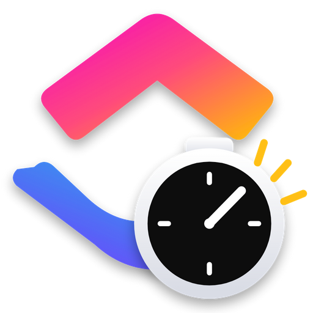

<div align="center">



# ClickUp Timer

**Mini painel de bandeja para o time tracking do ClickUp.**
Inicie e pare o cronômetro das suas tarefas sem abrir o navegador.


</div>

---

## Índice

| | |
|---|---|
| [O que ele faz](#o-que-ele-faz) | [Como usar](#como-usar) |
| [As três partes](#as-três-partes) | [Configurações](#configurações) |
| [Instalação](#instalação) | [Quando algo não funciona](#quando-algo-não-funciona) |
| [Primeiro acesso](#primeiro-acesso-pegar-o-token) | [Por dentro](#por-dentro) |

---

## O que ele faz

- **Lista suas tarefas** do ClickUp direto na bandeja do Windows.
- **Um clique inicia o cronômetro** — e para o anterior sozinho.
- **Resposta instantânea**: a tela muda no clique, a API confirma atrás. Nada de esperar.
- **Bolinha flutuante translúcida** sempre visível, com transparência ajustável.
- **Sobe com o Windows**, minimizado na bandeja.
- Tema **claro e escuro**.

---

## As três partes

### 1. Painel

A janela principal. Cronômetro grande, a tarefa em execução e a lista das suas tarefas.

| Ação | Como |
|---|---|
| Iniciar o timer de uma tarefa | Clique na linha dela |
| Parar | Clique de novo na tarefa ativa, ou no quadrado vermelho |
| Abrir a tarefa no ClickUp | Clique com o **botão direito** na linha |
| Filtrar | Digite em *Buscar tarefa* |
| Ver tarefas não atribuídas a você | Aba **Todas** |
| Esconder na bandeja | Botão **X** (não fecha o app) |

### 2. Bolinha flutuante

Uma pílula de vidro que fica por cima de tudo, com o logo, o cronômetro e o nome da tarefa.

| Ação | Como |
|---|---|
| Mover | Arraste (a posição fica salva) |
| Abrir/fechar o painel | Clique nela |
| Parar o timer | Passe o mouse e clique no quadrado |
| Ocultar | Passe o mouse e clique no **–** (ou botão direito → *Ocultar bolinha*) |
| Trazer de volta / ligar / desligar | Botão ◉ na barra de título, Configurações ou menu da bandeja |

Em repouso ela fica translúcida; com o mouse em cima vai a 100%. Um selo verde
no logo marca o timer rodando.

O **–** faz o mesmo que desligar a bolinha pelo botão ◉: ela some e o botão do
painel muda de estado na hora. Botão direito em qualquer ponto dela abre o menu
com abrir painel, ocultar e parar o timer.

### 3. Ícone da bandeja

| Estado | Ícone |
|---|---|
| Parado | Marca colorida |
| Rodando | Marca + selo verde |

Clique abre e fecha o painel. Botão direito: mostrar/ocultar, ligar a bolinha, parar o timer e **Sair** (a única forma de encerrar de verdade).

---

## Instalação

<details>
<summary><b>Opção 1 — Instalador (recomendado)</b></summary>

<br>

1. Dois cliques em **`GERAR-INSTALADOR.bat`**.
2. Espere. Na primeira vez ele baixa as dependências (alguns minutos).
3. Abra `dist\ClickUp-Timer-Setup-1.0.0.exe`.

Ele instala, cria o atalho no Menu Iniciar e na área de trabalho, aparece em
*Adicionar ou remover programas* e já abre o app.

> Precisa do [Node.js](https://nodejs.org) instalado. O `.bat` avisa se não achar.

</details>

<details>
<summary><b>Opção 2 — Portátil, sem instalar</b></summary>

<br>

Depois de gerar uma vez, o executável fica em:

```
dist\win-unpacked\ClickUp Timer.exe
```

Roda de qualquer lugar. Para um atalho com o ícone certo, dois cliques em
**`CRIAR-ATALHO.bat`** — ele cria na área de trabalho e, se você quiser, limpa o
cache de ícones do Windows.

</details>

<details>
<summary><b>Opção 3 — Modo desenvolvedor</b></summary>

<br>

```powershell
npm install
npm start          # roda o app
npm run debug      # + DevTools e log de cada requisição no terminal
npm run dist       # gera o instalador
```

</details>

---

## Primeiro acesso: pegar o token

1. No ClickUp, clique na **sua foto** (canto inferior esquerdo).
2. **Settings** → **Apps**.
3. Em *API Token*, clique em **Generate** (ou **Copy**).
4. Cole no app. Começa com `pk_`.

O token fica só neste computador, em
`%APPDATA%\ClickUp Timer\config.json`.

<details>
<summary>Prefere variável de ambiente?</summary>

<br>

```powershell
$env:CLICKUP_TOKEN = "pk_..."
$env:CLICKUP_TEAM_ID = "9017016599"   # opcional
npm start
```

A variável tem prioridade sobre o token salvo.

</details>

---

## Como usar

O fluxo do dia a dia é curto:

1. Abra pelo atalho (ou ele já está na bandeja desde que o PC ligou).
2. Clique na tarefa em que vai trabalhar. O cronômetro começa.
3. Trocou de tarefa? Clique na nova — o timer anterior para sozinho.
4. Acabou? Clique na tarefa ativa de novo, ou no botão da bolinha.

O tempo é gravado no ClickUp, igualzinho ao cronômetro nativo dele.
Se você parar o timer pelo site, o app percebe em até 20 segundos.

---

## Configurações

Engrenagem na barra de título (clique de novo para fechar).

| Opção | O que faz |
|---|---|
| **Bolinha flutuante** | Liga/desliga a pílula translúcida |
| **Transparência** | 15% a 100% — vale para quando o mouse não está em cima |
| **Iniciar com o Windows** | Sobe minimizado na bandeja ao ligar o PC |
| **Personal API Token** | Troque o token (em branco = mantém o atual) |
| **Workspace** | Escolha o espaço do ClickUp quando você tem mais de um |
| **Testar conexão** | Relatório linha a linha do que está funcionando |

Para trocar o logo da bolinha sem recompilar, coloque um `logo.png` em
`%APPDATA%\ClickUp Timer\`. Ele tem prioridade sobre o embutido.

---

## Quando algo não funciona

> Atalho universal: **Configurações → Testar conexão**. O relatório diz em qual
> etapa parou — token, usuário, workspace ou busca de tarefas.

<details>
<summary><b>A lista aparece vazia</b></summary>

<br>

Na ordem do mais provável:

1. **Nenhuma tarefa está atribuída a você** naquele workspace. Clique na aba **Todas**.
2. **Workspace errado.** Configurações → Workspace. O relatório do *Testar conexão*
   lista todos os IDs e marca o ativo.
3. **Token de outra conta.** Gere um novo em Settings → Apps.

</details>

<details>
<summary><b>Erro 401</b></summary>

<br>

Token inválido ou expirado. Gere outro em Settings → Apps → API Token e cole em
Configurações. O antigo para de funcionar na hora.

</details>

<details>
<summary><b>Erro 429</b></summary>

<br>

Limite de requisições do ClickUp (100 por minuto). Espere um minuto. Costuma
acontecer se você ficar apertando *Atualizar* sem parar.

</details>

<details>
<summary><b>Vários ícones na bandeja</b></summary>

<br>

Resolvido na versão atual — o app agora tem trava de instância única e abrir de
novo apenas traz a janela existente.

Se ainda vir vários, são processos antigos: **Ctrl+Shift+Esc**, procure
*ClickUp Timer* e finalize todos.

</details>

<details>
<summary><b>O atalho está com o ícone do Electron</b></summary>

<br>

É o cache de ícones do Windows, que guarda a imagem antiga pelo caminho do
arquivo. Dois cliques em **`CRIAR-ATALHO.bat`** e responda **S** quando ele
perguntar sobre limpar o cache. O Explorer reinicia e volta em um segundo.

</details>

<details>
<summary><b>A bolinha sumiu</b></summary>

<br>

Ela pode ter ficado fora da tela se você desconectou um monitor. Desligue e
ligue de novo pelo botão ◉ — ela volta para o canto inferior direito.

Se você clicou no **–** dela, ela foi ocultada: religue pelo botão ◉, por
Configurações ou pelo menu da bandeja.

</details>

---

## Por dentro

### Arquivos

| Arquivo | Papel |
|---|---|
| `main.js` | Processo principal. **Toda** conversa com a API do ClickUp acontece aqui |
| `preload.js` | Ponte segura (`contextBridge`) entre interface e processo principal |
| `index.html` | Painel — layout, estilo e lógica de tela |
| `bubble.html` | Bolinha flutuante |
| `icon.ico` / `logo.png` | Ícone do app e marca |
| `tray-idle.ico` / `tray-running.ico` | Bandeja, parado e rodando |

A interface nunca vê o token: ela pede por IPC e o processo principal responde.
Roda com `contextIsolation: true` e `nodeIntegration: false`.

### Endpoints usados (ClickUp API v2)

| Método | Rota | Para quê |
|---|---|---|
| `GET` | `/user` | Descobrir seu ID |
| `GET` | `/team` | Listar workspaces |
| `GET` | `/team/{id}/task?assignees[]=...` | Suas tarefas |
| `GET` | `/team/{id}/time_entries/current` | Timer em execução |
| `POST` | `/team/{id}/time_entries/start` | Iniciar |
| `POST` | `/team/{id}/time_entries/stop` | Parar |

### Onde ficam os dados

```
%APPDATA%\ClickUp Timer\
├── config.json     token, workspace, tema, transparência, posição da bolinha
└── logo.png        opcional — substitui o logo embutido
```

Nada sai daqui além das chamadas para `api.clickup.com`.

---

<div align="center">
<sub>Feito na Copasul · MIT</sub>
</div>
